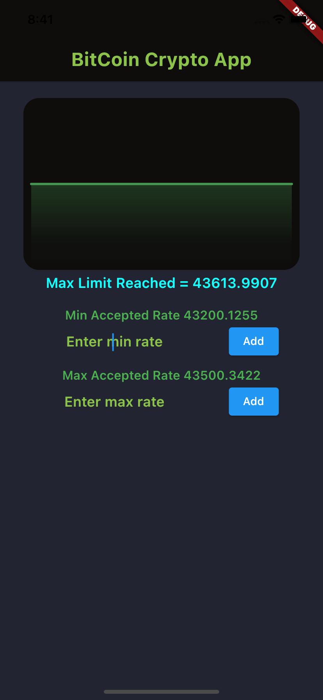
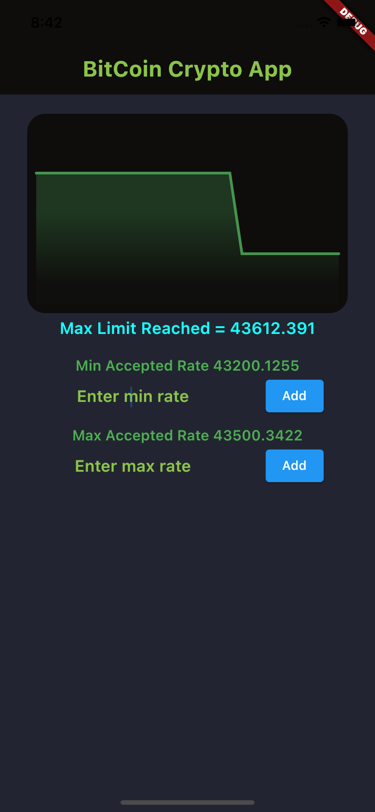

# NYTimes

A simple app to shows BitCoin real time rate. App built with Bloc architecture using  GetIt, Dart, Providers, ChartsLib Debugging, Realtime.

 

    
    

 

## The app has following packages:
1. **data**: It contains all the data accessing, repositories and manipulating components.
2. **injection_container**: Dependency providing classes using GetIt.
3. **models**: It contains data classes and or models.
4. **ui_screen**: View classes along with their corresponding ViewModels.
5. **widgets**: reusable widget classes .
#### Classes have been designed in such a way that it could be inherited and maximize the code reuse.
 

